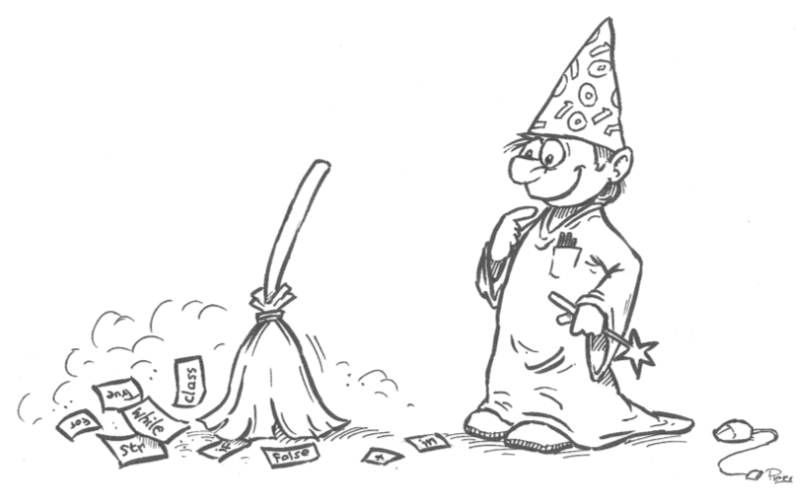

Schrijf een programma dat de gemeenschappelijke letters van twee ingegeven woorden bepaalt.

Een hoofdletter en een kleine letter mogen als verschillend beschouwd worden.
Een gemeenschappelijke letter mag maar één keer afgedrukt worden, ook al hebben ze hem meerdere keren gemeenschappelijk.

De letters moeten weergegeven worden in de volgorde waarin ze voorkomen in het eerste ingegeven woord
## Voorbeeld


### Invoer
```
Desalnietteminderwaardigheidscompleksteroog
paard
```

### Uitvoer
```
De woorden hebben volgende letters gemeen: adrp.
```

### Invoer
```
boek
rat
```

### Uitvoer
```
De woorden hebben geen letters gemeen.
```


*Hint:* Sla de letters die de woorden gemeen hebben op in een derde string. Vooraleer je er een nieuwe letter aan toevoegt, controleerje of deze letter niet al tot de string behoort.

<div class="dodona-centered-group">
  
  <p><small>Naar oefening 7.6 uit <em>De programmeursleerling, Pieter Spronck</em>.</small></p>
</div>
